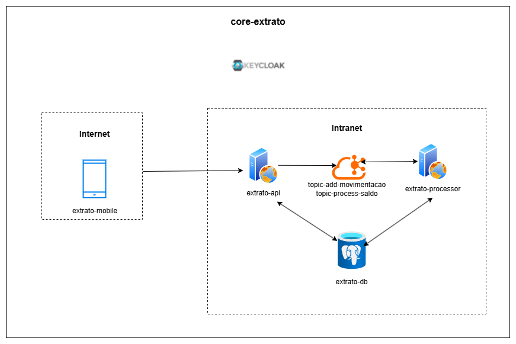
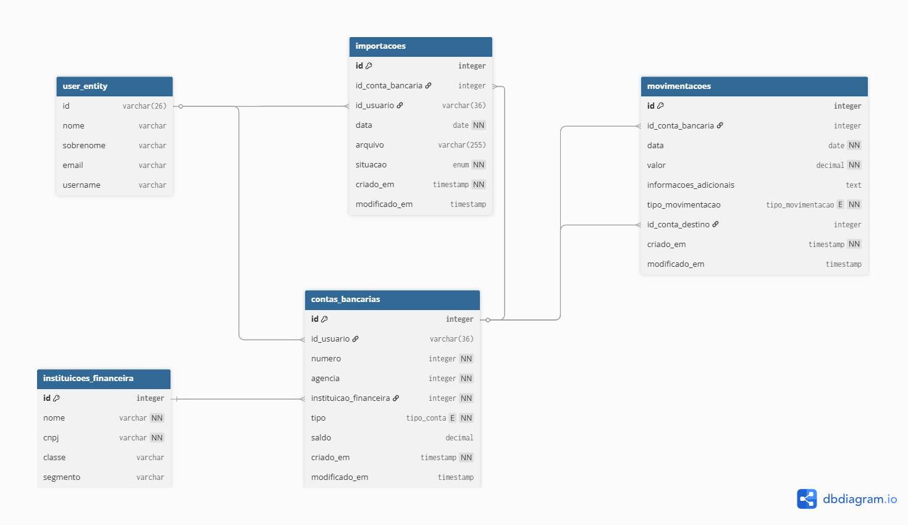

# 💳 Extrato
Esta aplicação tem como principal objetivo a consolidação de conceitos teóricos acerca da Arquitetura de Software, visando a construção de um ecossistema para controle financeiro.

## 🔧 Arquitetura
O projeto está subdivido em três serviços, sendo:

- `extrato-mobile:` Aplicativo móvel construído com React Native + Expo.
- `extrato-api:` Serviço que servirá como os endpoints REST no qual o `extrato-mobile` fará as interações.
- `extrato-processor:` Serviço responsável por ler e processar os tópicos do Kafka de inclusão de movimentações e saldo bancário.

### Desenho de solução

### Banco de dados

### 🧩 Tecnologias e detalhes da solução

- Banco de dados: PostgreSQL
- Mensageria: Apache Kafka
- Autenticação: Keycloak
- Mapstruct: Para mapeamento de entidades e DTOs
- QueryDSL: Para construção de consultas SQL de forma fluente

## 🚀 Requisitos

- Node.js (para o extrato-mobile)
- Java 17+ (para os serviços backend)
- Docker e Docker Compose (para banco de dados e Kafka)
- Yarn ou npm

## 🧬 Evolução
- Reconhecer automaticamente a conta bancária a partir do extrato
- Envio de notificações push 